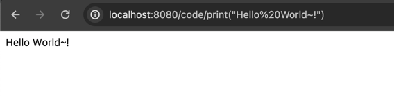
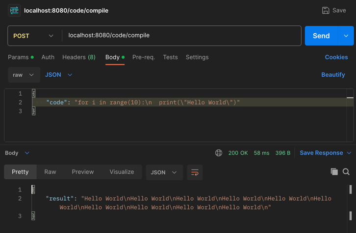
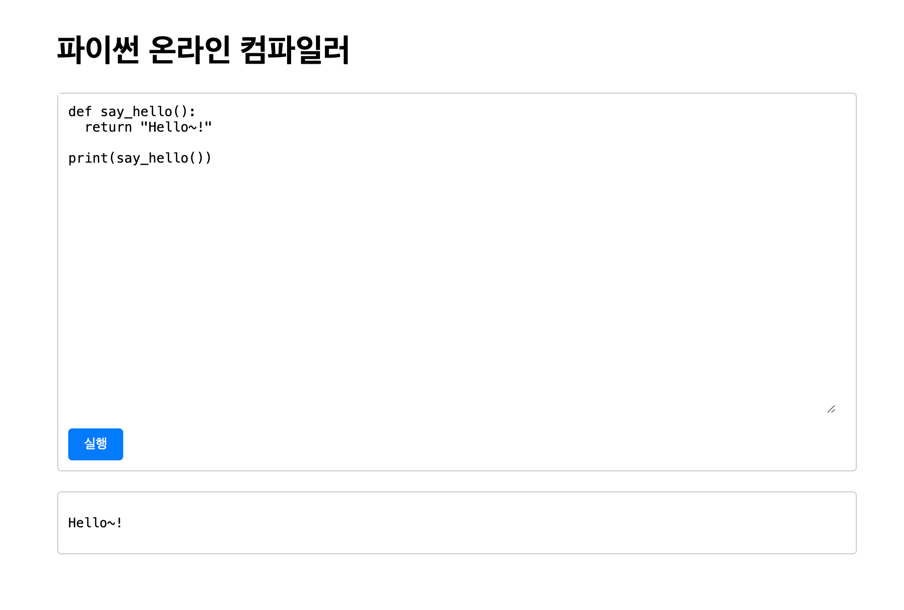

# 파이썬 코드 실행 api

================

- backend: kotlin/springboot
- [frontend](https://github.com/chanwooo/compile-web)
  : next.js

웹페이지 혹은 REST API로 파이썬 코드를 실행할 수 있는 서버입니다.

```json
GET localhost:8080/code/{실행할 파이썬 코드}
=> response
"{실행결과}"
```


```json
POST localhost:8080/code
{
    "code": "{실행할 파이썬 코드}"
}

=> response
{
"result": "{실행결과}"
}

```



[프론트 페이지를 통해 실행](https://github.com/chanwooo/compile-web)

